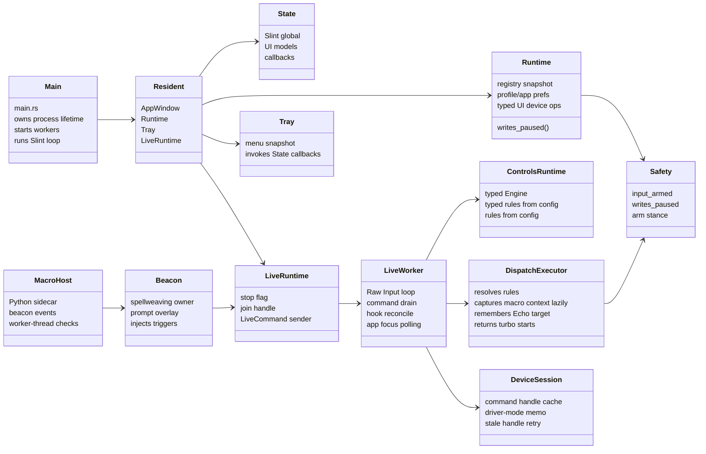
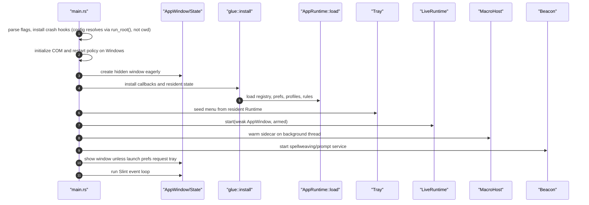
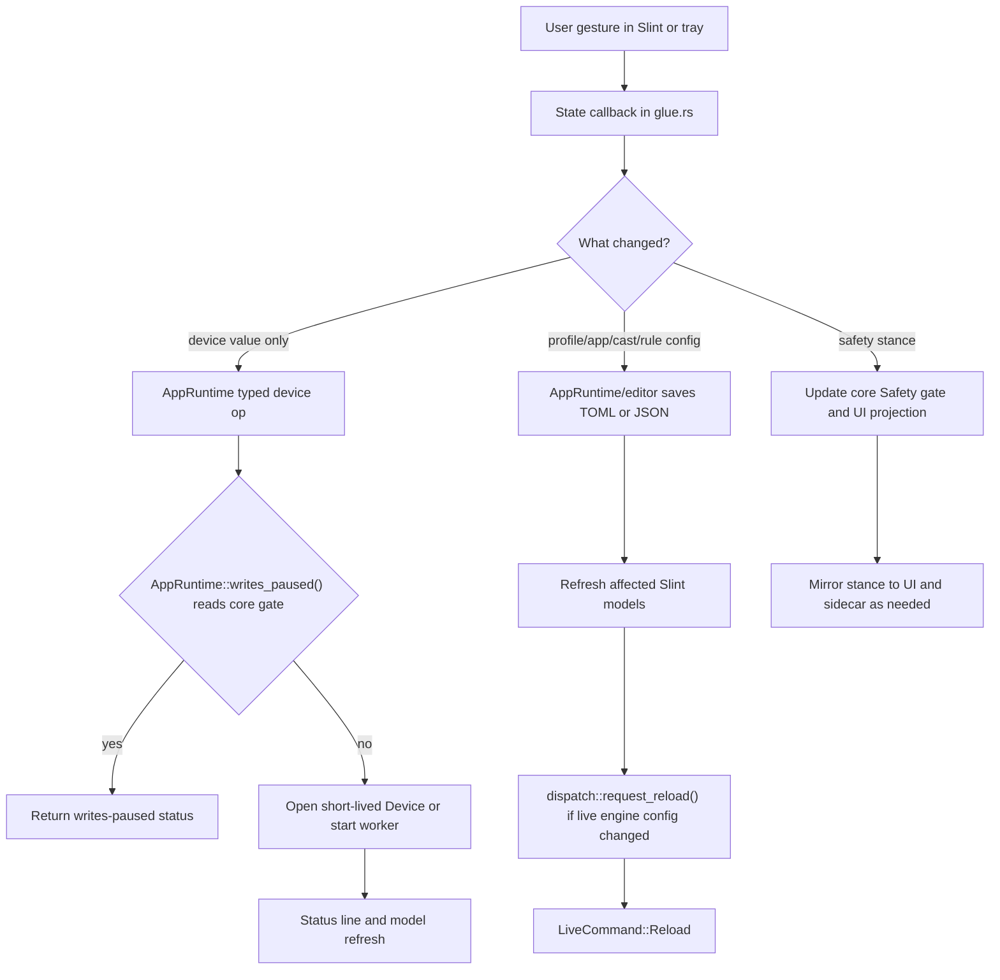
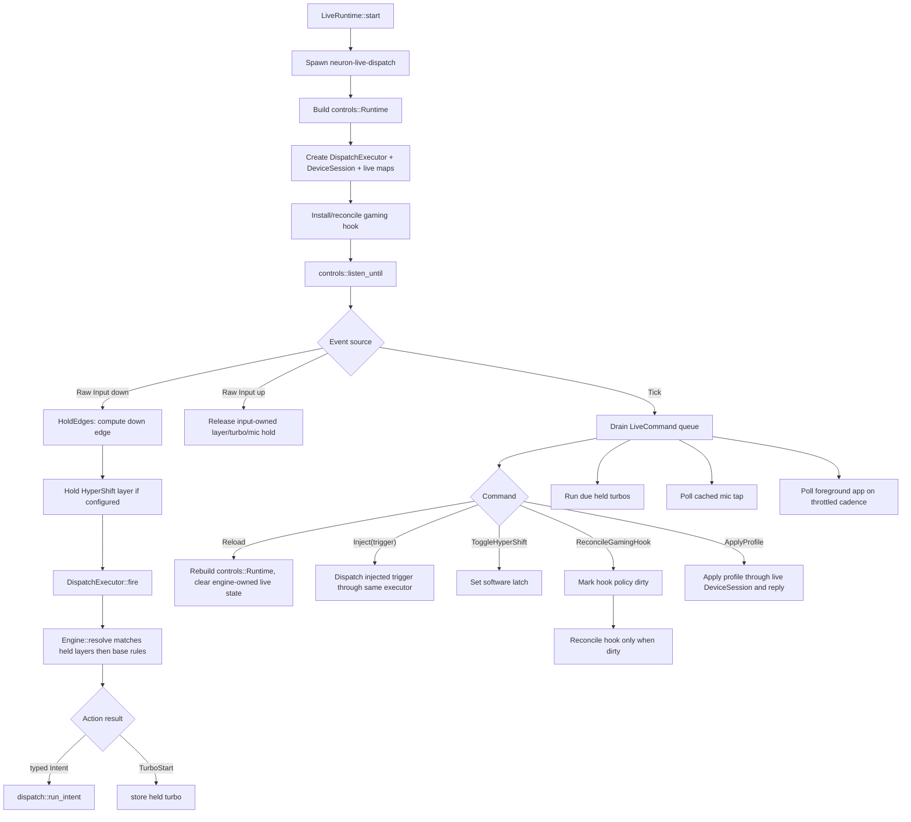
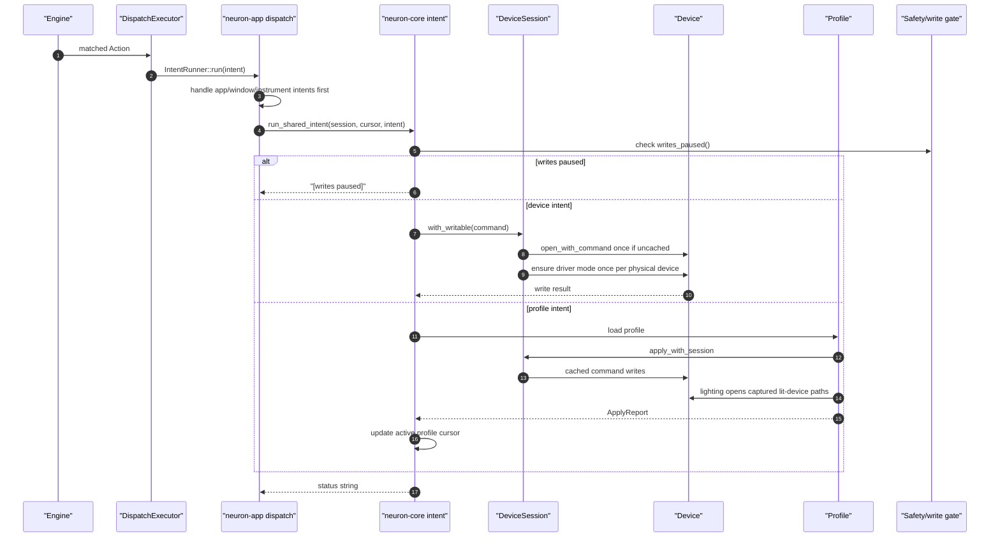
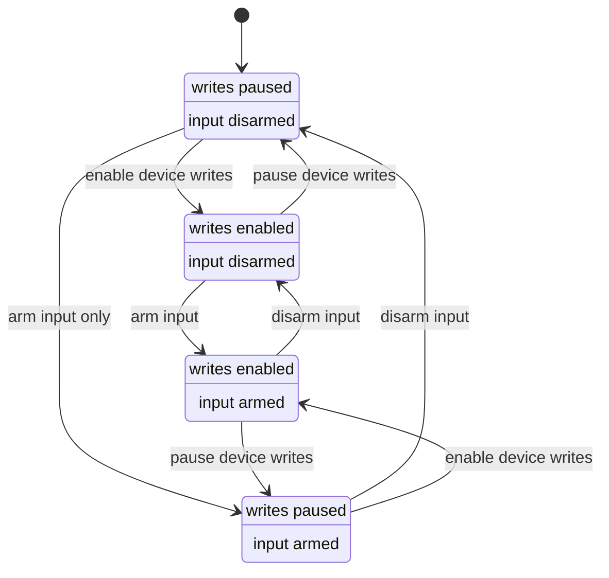

> **kind:** app-level technical design — how neuron is built. The living architecture
> doc, and the map most worth reading first. What it *does* is [`GDD.md`](GDD.md).
>
> **as of:** 2026-06-19; §8 test-surface refreshed 2026-07-09 · **trust:** high, broadly
> matches the tree.
>
> **🤖 agent-generated.** An LLM wrote this while building neuron. It may be stale or
> wrong. The code is the source of truth; verify before you lean on a detail.

# Neuron Technical Design Document

Updated: 2026-06-19

## 1. Purpose

Neuron is a Windows-first, tray-resident replacement/control layer for Razer Synapse. Its day-to-day job is to keep device control, profile switching, remaps, macros, spellweaving, audio controls, and utility overlays available in one long-lived user process without a vendor daemon, account, cloud, or kernel driver.

The product invariant is:

```text
Trigger -> Action
```

Every dispatchable input source becomes a `Trigger`; every dispatchable effect becomes an `Action` or typed daemon/app `Intent`. The app must not grow separate dispatch pipelines for buttons, glyphs, radial wedges, app focus, or hardware controls. Macro beacon prompts are handled as explicit sidecar question/answer events, not as dispatch actions.

## 2. Workspace Shape

The workspace has six crates:

- `crates/neuron-core`: hardware protocol, profiles, bindings, trigger/action engine, shared dispatch executor, device session resolver, import, macros, gesture/rhythm/twin logic, and process-wide safety gates.
- `crates/neuron-app`: Slint desktop app, tray resident runtime, live dispatch worker, UI glue, spellweaving/beacon service, overlays, audio UI, window instruments, diagnostics, and reliability surfaces.
- `crates/neuron-cli`: command-line device control and daemon-style run path. It is still an important reference implementation for the GUI live dispatcher.
- `crates/neuron-host`: the protocol-host kernel (ownership arbiter, signal bus, declaration journal, restart governor, host shell) plus the OpenRGB and Chroma protocol adapters other apps drive Neuron through.
- `crates/engram`: trajectory codec used by the newer rhythm/twin systems.
- `crates/neuron-testkit`: shared test scaffolding (mock transport, fault injection) for the other crates.

Important non-code state:

- `profiles/*.toml`: saved profile bundles.
- `profiles/*.rules.toml`: flat trigger/action rule sidecars, including imported or GUI-authored HyperShift layer rules.
- `cast.toml`: spellweaving trigger, activation phrase, radial sector actions, HyperShift radial options, glyph bindings, and instrument rhythm slots.
- `feel.toml`: HyperShift stance and hold/tap timing behavior used by the live controls runtime.
- `apps.toml`: foreground-app profile switching rules.
- `gestures.json`: glyph vault.
- `app.toml`: GUI preferences such as launch mode, accents, weave material, and Phoenix restart preference.
- `backups/*.json`: read-only snapshots of device getter state.
- `runtime/`: runtime assets and generated state for overlays/twin/knockback.

## 3. App Runtime Model

`crates/neuron-app/src/main.rs` owns process lifetime.

Startup flow:

1. Pin the current directory to the executable directory so autostart does not read/write config under `C:\Windows\System32`.
2. Handle special one-shot paths: `--weave-proof` and, on Windows, `--purge-synapse`.
3. Install panic logging and native-fault breadcrumbs into `neuron-crash.log`.
4. On Windows, register application restart when Phoenix is enabled.
5. On Windows, initialize COM as STA for winit/Slint/tray compatibility.
6. Build the Slint window eagerly but hidden, install `glue`, and retain the window plus app runtime in `Resident`.
7. Seed the tray from that real resident runtime, avoiding a second throwaway config/runtime load.
8. Set the process-wide input arm state and start live dispatch with `dispatch::LiveRuntime::start`. On non-Windows builds, the UI reports live dispatch as unavailable instead of pretending a device backend exists.
9. Warm the Python Macro Host sidecar on a background thread.
10. Start the beacon/spellweaving service.
11. Show the window unless launch preferences request tray startup. `--tray` only starts hidden when `app.toml` says start-minimized; autostart can be configured for tray or visible-window launch.
12. Run `slint::run_event_loop_until_quit`.

The app is a single process, but not a single thread. Slint is the owner of UI state; worker threads post plain data back through `slint::invoke_from_event_loop`.

Core long-lived workers:

- UI event loop and 60 ms tray/hotkey pump in `main.rs`; slower housekeeping such as status aging, safety projection, tray menu sync, and reliability refresh is cadence-gated instead of recomputed every tick.
- On Windows, live dispatch worker in `dispatch.rs`; on non-Windows no live worker/command sender is installed and the UI reports the backend unavailable.
- Beacon router and weave presenter in `beacon.rs`.
- Python Macro Host sidecar and event reader in `neuron-core/src/macros`.
- Optional lighting animation worker in `runtime.rs`.
- Optional overlay/window instrument workers, such as spell overlay, teleport scry, whiteboard, knockback, and glance helpers.
- On Windows, audio cache worker in `beacon::audio_cache` so Core Audio reads do not block hot input paths.

Cross-platform state today is explicit but incomplete. The architecture has transport traits and non-Windows stubs, but the live HID backend and several app runtime features are Windows-only. The daily-driver runtime is Windows-first until the transport identity model and backend implementations are made platform-neutral.

## 4. Core Runtime Loop And Logical Flow

This section is the current runtime map. The central idea is one resident process with clear ownership boundaries:

- Slint/UI state is owned by the main thread.
- Live input dispatch is owned by the Windows live worker.
- Device intent execution is shared in core and receives a `DeviceSession` from the caller.
- Safety gates are process-global and read by both UI and live paths.
- Persisted config is the reload boundary between UI edits and the live engine.

### 4.1 Runtime Ownership Map



### 4.2 Process Startup Sequence

Startup intentionally avoids duplicate runtime/config loads. The hidden Slint window and its real `AppRuntime` are built before tray seeding, so the tray reflects the same resident state the UI will use.



### 4.3 UI Mutation And Reload Loop

UI callbacks are intentionally boring: mutate typed state, persist if needed, refresh invalidated UI models, then notify live dispatch when the engine input set changed. Tray paths should reuse the same `State` callbacks unless they are deliberately live-only controls such as software HyperShift latch.



Logical constraints:

- UI state is the presentation surface, not the dispatch engine.
- Files are the stable boundary for profile/rule/cast/app changes.
- `request_reload` is mandatory after edits that affect `controls::build_runtime`.
- Device operations from UI are explicit user actions; repeated hot-loop device work belongs in the live worker or a cache.

### 4.4 Live Worker Loop

The live worker is the core day-to-day loop. It owns Raw Input, live command draining, active held layers, held turbo cadence, cached command-capable device handles, and low-level gaming hook reconciliation.



Logical constraints:

- Hardware, mic tap, app-focus, and beacon/weave-injected radial or glyph triggers converge through `DispatchExecutor` and the same `Engine`; Macro Host beacon prompts remain explicit sidecar Q/A events.
- `LiveCommand::Reload` is the invalidation boundary. It rebuilds `controls::Runtime`, clears executor echo history, cached `DeviceSession` handles, held turbos, momentary mic holds, and the live action description; software HyperShift latch and non-engine samplers remain live-local.
- `LiveCommand::ApplyProfile` is the manual GUI profile-apply path. The UI starts a short helper thread that waits for the live worker's reply and posts the result back through `slint::invoke_from_event_loop`; hardware writes stay on the live `DeviceSession`.
- Gaming policy writes a process-global policy cell first, then sends `LiveCommand::ReconcileGamingHook`; the worker owns hook reconciliation on the message-pumping thread.
- Foreground-app switching uses `neuron-core/src/app_focus.rs` for shared cadence/edge detection in both GUI and CLI. The active-app sample is still polling, and remains the platform-event-hook candidate.

### 4.5 Intent And Device Write Flow

Typed actions become `Intent`s when they need resident app services or device/profile writes. App/window/instrument intents are handled by `neuron-app`; shared device/profile intents run in `neuron-core/src/intent.rs`.



Important device lifetimes:

- `Device::open_path` is the lowest-cost path when enumeration already produced a control interface path.
- `Device::open_with_command` is the one-shot resolver for short CLI/UI operations.
- `DeviceSession::with_writable` is for proven command-capable writes that should enter driver mode and retry a stale cached handle once.
- `DeviceSession::with_command` is for higher-level write helpers that own their own gate/handshake preflight.
- `Profile::apply` creates a short `DeviceSession` for direct CLI/core callers; GUI/manual and live profile applies use the live worker session.
- Profile lighting may span devices, so it enumerates lit devices once and opens those captured paths directly.

### 4.6 Safety State Machine

The user-facing stance is a projection of two process-global gates: device writes and input synthesis. Slint and tray keep view state for presentation, but write checks use `AppRuntime::writes_paused()`, which reads the core write gate.



Safety invariants:

- Tests must not arm real input.
- `neuron-app --safe` disarms input and macro sidecar authority, but does not automatically pause the global write gate.
- `neuron-cli run --safe` disarms input and pauses writes.
- App/window intents are routed before the device write gate; device/profile intents are routed after it.

### 4.7 Accepted Runtime Tradeoffs

The current code is cleaner than the original shape, but these are still deliberate boundaries:

- The 60 ms UI timer is still the tray/hotkey pump. Slower UI housekeeping is cadence-gated, not fully event-driven.
- Foreground app switching still polls the active app on the live worker. A platform event hook would be more elegant on Windows, with polling as fallback for cross-platform backends.
- Macro Host warmup is a startup latency tradeoff. It is off the UI thread, but it is still an eager sidecar cost.
- `DeviceSession` caches by command, not by physical-device object. That is simple and avoids most repeated enumeration/handshake cost, but a per-physical-device cache would be tighter if multiple hot commands pound the same device.

## 5. Core Event Flow

### 5.1 UI And Tray Flow

The Slint view exposes a single global `State` object. `glue::install` binds callbacks to typed `AppRuntime` methods, live-worker commands, and refresh helpers.

The key rule for UI mutations:

```text
write state -> save if needed -> refresh invalidated models -> request live reload if engine config changed
```

Examples:

- GUI-authored binding edits update `profiles/gui.rules.toml`, refresh rule views, and call `dispatch::request_reload`. Imported sidecars can live in any `profiles/*.rules.toml`; `bindings.toml` is lifted into typed `Trigger::Input -> Action` rules by the live builder.
- Cast/radial/glyph edits save `cast.toml` or `gestures.json`, refresh their panels, and call `dispatch::request_reload`.
- App rules save `apps.toml`, refresh rule views, and call `dispatch::request_reload`.
- Profile apply writes live device/profile state, updates gaming-mode policy for the low-level hook, and mirrors the active profile into the process-global profile cursor used by live profile cycling.

Tray actions are intentionally routed through the same `State` callbacks where possible. That keeps tray and GUI behavior aligned and avoids a second implementation of profile/effect/write toggles. A few tray paths are deliberately more direct: HyperShift toggles the live dispatch latch, and brightness/DPI nudges seed UI values before invoking the normal callbacks.

### 5.2 Live Dispatch Flow

`dispatch::LiveRuntime::start` starts `neuron-live-dispatch` on Windows. It owns a stop flag, join handle, and a private command channel. Public calls such as `request_reload`, `inject_trigger`, manual profile apply, gaming-policy changes, and the tray HyperShift latch send `LiveCommand`s into that worker so hook reconciliation, profile device writes, and live dispatch state stay on the input-pump thread. The gaming policy itself is a process-global cell updated before notifying the worker. On non-Windows builds no worker or live command sender is installed.

The worker:

1. Arms input if launched outside `--safe`.
2. Builds `neuron::controls::Runtime` with `controls::build_runtime`.
3. Creates one `DispatchExecutor`, one `DeviceSession`, a held-turbo map, and momentary mic state for the lifetime of the live loop.
4. Installs/reconciles the gaming-mode low-level keyboard hook on the same thread that pumps input.
5. Enters `controls::listen_until`.
6. Converts Raw Input reports into per-control down/up edges with `HoldEdges`.
7. On down:
   - hold any HyperShift layer activated by that trigger,
   - resolve and fire matching actions through `DispatchExecutor` and the unified `Engine`,
   - start held turbo repeats returned by the executor,
   - start momentary mic handling if configured.
8. On up:
   - release layers owned by that input,
   - stop any held turbo owned by that input,
   - restore momentary mic state.
9. On tick:
   - drain `LiveCommand`s for reloads, injected triggers, manual profile apply, gaming-policy changes, and software HyperShift latch changes,
   - pulse the flight recorder,
   - rebuild the engine when a reload was requested, clearing executor history, stale device handles, held turbos, and momentary mic holds,
   - fire injected spellweaving triggers through the same executor path as hardware,
   - reconcile software HyperShift latch,
   - reconcile the gaming-mode hook only after a pushed policy change,
   - run due held turbo repeats without re-resolving rules,
   - poll cached mic tap state,
   - poll foreground app changes and fire `Trigger::AppFocus`.

Mic tap intentionally fires both the semantic `Trigger::MicTap` form and the synthetic input form used by `bindings.toml`, so flat bindings and typed sidecar rules both converge through the same engine.

The worker is deliberately resilient: `listen_until` is wrapped in `catch_unwind`, ESC does not stop it, and unexpected listener exits are logged and reopened until an explicit stop flag is set.

Held turbo repeat timing is shared in `neuron-core/src/executor.rs` as `TurboRuntime`; the GUI and CLI still own their distinct event pumps, but repeat cadence, release, and reload clearing semantics now live in one core helper.

The CLI daemon path in `crates/neuron-cli/src/main.rs` uses the same `DispatchExecutor`, `TurboRuntime`, `DeviceSession`, hold-edge model, and `neuron-core/src/intent.rs` device/profile intent runner for the shared spine path. App/window/instrument intents are GUI-resident only. CLI remains a useful parity check, but it still polls Core Audio directly for mic taps instead of using the GUI audio cache.

### 5.3 Engine Assembly

`neuron-core/src/controls.rs` is the canonical builder for live rules.

The engine folds:

- `bindings.toml` into typed `Trigger::Input` rules.
- `cast.toml` radial sectors into `Trigger::RadialSector` rules.
- `cast.toml` glyph bindings into `Trigger::Gesture` rules.
- HyperShift radial sectors into layer-tagged rules when enabled.
- `profiles/*.rules.toml` sidecars verbatim, preserving `Rule.layer`.
- `apps.toml` into `Trigger::AppFocus -> Action::ProfileSwitch` rules.

The GUI rule table uses the same `build_runtime_from(...).engine.to_rules()` assembly for read-only rows, excluding only `profiles/gui.rules.toml` so GUI-authored rows can remain removable with stable edit indexes.

The matcher itself is `neuron-core/src/engine.rs`. It supports exact trigger matching, PID-optional input matching, substring app-focus matching, held-layer resolution, and deterministic ordering: held layers first, base layer last.

Live dispatch uses `neuron-core/src/executor.rs` as the shared execution algorithm. `DispatchExecutor` resolves rules, captures macro context only when at least one matched action needs it, remembers the last non-echo action for `Action::Echo`, routes typed intents through an embedding `IntentRunner`, and returns held-turbo start requests to the caller.

The shared device/profile subset of intents lives in `neuron-core/src/intent.rs`. GUI and CLI provide different active-profile cursors, while DPI/profile/write-gate behavior stays in one implementation. GUI-only app/window/instrument intents stay in `neuron-app`.

Held-layer rules do not automatically suppress base-layer rules; an override must be represented by rule/action design, not assumed from the layer ordering.

### 5.4 Spellweaving And Beacon Flow

`beacon.rs` is the single owner of the cast trigger while idle.

It has two faces:

- Live spellweaving: wait for the configured activation phrase, stream motion to the overlay, resolve the path as a radial wedge or glyph, then inject the resulting `Trigger` into live dispatch.
- Beacon answering: when a Python macro asks a question, present a non-modal overlay and resolve a deliberate flick into yes/no/pass. This does not synthesize input and is safe in observe mode.

The important architecture point: spellweaving does not execute actions directly. It calls `dispatch::inject_trigger`, which sends `LiveCommand::Inject(trigger)` to the live worker. The worker fires that trigger through `DispatchExecutor` and the same engine as hardware inputs.

Macro beacon prompts are the exception to the `Trigger -> Action` rule: they arrive as MacroHost `BeaconEvent`s and are answered through the sidecar channel. They do not synthesize input and do not execute engine actions.

Instrument requests, such as teleport, whiteboard, dial, control center, and knockback, are app-level intents. They are routed through `dispatch::run_intent` to `beacon::request_instrument` or the relevant instrument module, not through device writes. App/window intents are handled before the device write gate; device/profile intents are checked after app-level routing.

### 5.5 Device And Profile Flow

`neuron-app/src/runtime.rs` is the GUI-facing runtime. It owns registry/config snapshots and performs short, typed device operations on demand.

`neuron-core/src/device.rs` exposes two device lifetimes:

- `Device::open_path`: open an already-enumerated control interface without another HID enumeration.
- `Device::open_with_command`: one-shot capability resolution. It enumerates connected HID interfaces once, opens the matching control path directly, and returns a fresh transport.
- `DeviceSession`: live-loop/daemon caching for direct live intents such as DPI and resident profile applies/switches. It keeps command-capable handles for a worker lifetime, memoizes the Razer driver-mode handshake per physical device, and `with_writable` reopens and re-handshakes once if a cached handle fails after sleep, unplug, or wireless wake. `Profile::apply` creates a short one-shot session for CLI/direct callers; GUI manual apply and live `ProfileSwitch`/`ProfileCycle` reuse the resident live session.

Device writes follow these constraints:

- GUI writes check `AppRuntime::writes_paused()`, which reads the process-global core write gate.
- Live daemon/device intents check the process-global `neuron::writes::writes_paused`.
- Riskier writes remain feature/env gated in `neuron-core/src/writes.rs`.
- Device reads are best-effort and may honestly return unavailable/asleep state.
- Profile apply is idempotent and writes only populated profile fields.

**The write gate itself** (`writes.rs`) is three steps, and its whole point is that a write is only "done" once it round-trips on real hardware: (1) flip Razer driver mode `0x03` so host control is accepted (`ensure_driver`); (2) write volatile / `NOSTORE` first so nothing flashes to onboard until it's proven correct; (3) re-read the matching getter and confirm the bytes we set landed (`verify_getter`) — if the device doesn't echo what we wrote, the call **errors** instead of lying that it worked. A control with *no* getter can't be verify-gated at all, which is why a few writes stay behind per-feature `NEURON_*_WRITE` env flags until a live capture confirms their byte layout; the honesty table in the README tracks which are proven / gated / absent.

The GUI and live dispatcher keep write pause state synchronized by not owning duplicate write authority. `glue` updates `neuron-core/src/safety.rs`, while Slint and tray mirror that state as presentation. `safety.rs` is the in-process source of truth for input-armed and writes-paused state; `action.rs` and `writes.rs` are compatibility fronts over that state.

### 5.6 Macro Flow

Python macros run through the Macro Host sidecar, not inside the app process. The GUI warms the sidecar after startup. Macro check/save/test paths use worker threads; syntax checking no longer waits on the sidecar from the UI callback.

Safety model:

- `Action::Run`, shell/file script tiers, input injection, and macro helper input synthesis respect the arm gate.
- Shell/file launchers scrub the legacy `NEURON_INPUT_ARMED` environment variable as defense-in-depth, but runtime authority is the in-process safety state and explicit Macro Host arm frames.
- The Macro Host uses `NEURON_PYTHON` or a bundled `runtime/python` interpreter when present. Falling back to system Python on `PATH` requires `NEURON_ALLOW_SYSTEM_PYTHON=1`.
- Raw Python can still do arbitrary process actions by design; this is not sandboxed.
- Macro beacon prompts route through `beacon.rs` so asking the user does not block the UI thread or the live dispatch worker.

### 5.7 Device Identity, Discovery, And Input Decode

Everything in §5.5 assumes a device is already *modeled*. This is how one gets modeled, and how its live button/event reports are read. The seam is the `Dialect` trait (`neuron-core/src/dialect.rs`): bytes live below it, `Capability` semantics above it, and per-device wiring (opcodes, geometry, quirks) lives in TOML neither layer hardcodes.

**Claiming is pipe-shape, never PID.** `claimed_by(info)` walks `DIALECTS = [razer, razer-audio, hidpp]` and returns the first whose `claims()` matches the HID pipe's signature — razer by `vid==0x1532 && feature_len==91`, razer-audio by the 64-byte Consumer-Control envelope, hidpp by output/input report shape. So a new device with a known shape auto-adopts with no code; a new *wire shape* lands on the unclaimed ledger (`synth.rs unclaimed_from`, surfaced as the device-page "N razer vendor pipes · no shared protocol" footer) until a dialect is written for it. The razer-audio dialect (Seiren) is the worked example of adding a third family: one `DIALECTS` entry, nothing above the seam changes.

**Synthesis mints evidence-typed beliefs.** `discover.rs`/`synth.rs` probe the getter space read-only against a universal command catalog, keep only commands the device answers SUCCESS for, and emit a paired setter only when its getter answered ("writes are not probes"). `Proven<T>` has no public constructor outside the probe, so code above the seam cannot forge evidence; `Heuristic<T>` marks era-inference (tx cohort, and the rows×cols geometry guess — mouse `(1,2)` else keyboard `(6,22)`, the one fact no getter reveals). The result is written to `devices/auto/<dialect>-<pid>.toml`; a curated `devices/*.toml` shadows it. The one field synthesis cannot prove is the transaction id (a wrong-tx write ACKs then no-ops); `first_light_heal` walks the cohort `[0x1F,0x3F,0xFF,0x9F]` on first lighting apply and rewrites the auto file when read-back proves a different tx.

**Input decode (`hidwatch.rs decode`)** reads device-pushed reports on the readable sibling pipes in priority order: a def's own `[events]` table, then the dialect's family vocabulary (`default_event_for`, e.g. razer-audio's `05 11` tap-mute), then the hardcoded 04/05 families:

- `04 <code>` — Razer driver-mode deferred buttons. The firmware, once neuron takes driver-mode custody, hands neuron its onboard macro/DPI/scroll buttons as bare per-press events; neuron IS the implementer. Codes verified live on the BlackWidow: `0x01`=FN, `0x20..0x24`=M1..M5, `0x00`=release.
- `05 02 <X_be><Y_be>` — DPI change, value carried big-endian per axis (verified live on the Naga: `05 02 03 20 03 20`=800, `05 02 75 30 75 30`=30000). Drives the wake-reconcile that heals a stale volatile plane.
- `05 3a <stage> <?>` — scroll/sensitivity stage. Byte[2] is the stage (read); byte[3] (`0x82`/`0x85` observed) is an unread field, not yet decoded.
- `05 0c` — power/charge poke (also fires on wake); settles charge + reasserts config.
- `05 0e <strap>` — side-plate strap code (push-only, no getter — this report *is* the detection), resolved to a label via `[side_plates]`.

**Live-verified boundaries (negative knowledge).** A read-only report-shape ledger (open every non-keyboard/non-mouse Razer pipe, log deduped report shapes) confirmed the vocabulary above against real hardware and earned facts that cost a poke to learn: the headset volume knob emits nothing on any readable pipe (analog/OS-swallowed); of the Naga's four undefined-usage vendor pipes only one is the live event channel; the mouse thumb-grid buttons ride the primary mouse/keyboard HID (correctly unopened), not a vendor pipe; and the BlackWidow's consumer pipe stays silent for FN+F-row media while neuron holds driver-mode custody — the custody-complementarity of §9's input-model risk, observed.

## 6. Safety And Reliability Contracts

### 6.1 Arm Gates

There are two independent live gates, both owned in-process by `neuron-core/src/safety.rs`:

- Input arm gate: `neuron::action::arm_input`.
- Device write gate: `neuron::writes::set_writes_paused`.

The GUI combines them into four stances:

- Observe: writes paused, input disarmed.
- Device: writes enabled, input disarmed.
- Input: writes paused, input armed.
- Live: writes enabled, input armed.

Tests must never arm real input. The live dispatch worker starts only from `main`, not from UI tests.

`neuron-app --safe` is narrower than the Observe stance: it disarms input and the macro sidecar, but does not by itself pause the global device-write gate. `neuron-cli run --safe` disarms input and pauses device writes.

### 6.2 Hot Path Blocking

The hot path should not perform slow COM or device enumeration except where explicitly accepted:

- Mic tap detection uses `beacon::audio_cache` instead of querying Core Audio inline.
- Dispatch only captures macro context if a matched action needs context.
- Command-capable live writes use `DeviceSession` to avoid repeated HID enumeration and recover once from stale cached handles.
- `ProfileSwitch` and `ProfileCycle` call `Profile::apply_with_session` so device/profile intents stay on the live `DeviceSession`; named/per-LED lighting enumerates lit devices once and opens the captured HID paths directly because the lighting canvas may span multiple physical devices.
- Foreground app switching still queries the active app from the live worker on a throttled cadence; this is accepted polling for now and should move behind a platform event hook if app-focus switching becomes latency- or power-sensitive.
- Device handles are opened, used, and dropped for UI operations rather than stored in shared GUI state.
- Long-running lighting animations use their own stop flag and worker.

### 6.3 Crash And Stall Visibility

The app uses a flight recorder and crash log to turn silent failures into visible state:

- Rust panics log message, location, backtrace, and flight trace.
- Native faults log SEH code/address and flight trace.
- Windows application restart can relaunch the app after crash/hang.
- The UI heartbeat watches organ heartbeats and surfaces stalled dispatch/weave workers on a slower cadence than the tray/hotkey pump.
- Worker loops that own core interaction are panic-walled and continue where possible.

### 6.4 Ownership Rules

Only one subsystem may own a physical trigger at a time:

- Press-to-bind sets `capture::CAPTURE_ACTIVE`; live dispatch tracks edges but fires nothing while capture is active.
- `EditorWeave` blocks beacon/live weave capture while the gesture/radial editor owns the cast trigger.
- Whiteboard and knockback publish active trigger ownership so live weave slots on the same key stand down.
- Beacon prompts preempt live weave but do not steal focus or synthesize input.

## 7. Persistence Model

| Data | File | Writer |
|---|---|---|
| GUI prefs | `app.toml` | `prefs.rs`, `glue.rs` |
| Device profiles | `profiles/<name>.toml` | `profile.rs`, `runtime.rs` |
| Device-control bindings | `bindings.toml` | `bindings.rs`, CLI/manual paths |
| Imported/GUI rules | `profiles/*.rules.toml`; GUI-authored rules use `profiles/gui.rules.toml` | importer/editor paths |
| App focus rules | `apps.toml` | `runtime.rs`, `glue.rs` |
| Cast/radial/glyph action config | `cast.toml` | `editor.rs`, `glue.rs`; core `cast.rs` owns the path/types/load behavior |
| Feel/HyperShift timing | `feel.toml` | `feel.rs`, `glue.rs`; `controls.rs` reads it during `build_runtime` |
| Gesture vault | `gestures.json` | `gesture.rs`, `glue.rs` |
| Macro scripts | `macros/scripts/*.py` | macro editor |
| Device backups | `backups/*.json` | `runtime.rs`, `backup.rs` |
| Reliability log | `neuron-crash.log` | `flight.rs`, panic/native hooks |

Runtime state that can be recomputed should not be persisted as truth. The UI should seed from device/config truth at install and after invalidating operations.

## 8. Current Test Surface

Primary commands:

```powershell
cargo test --workspace
cargo test -p neuron
cargo test -p neuron-app
cargo test -p neuron-cli
cargo test -p engram
```

Useful focused checks:

```powershell
cargo test -p neuron-app runtime_loads_headless
cargo test -p neuron-app apptest
cargo test -p neuron-app diagnostics_yield_verdicts_without_hardware
cargo test -p neuron build_runtime_folds_every_source_into_one_engine
cargo test -p neuron-cli tests_never_arm_input
```

Coverage that already exists:

- Engine resolution, held layers, app-focus matching, rule serialization, and arm-gated actions.
- Shared `DispatchExecutor` behavior, including echo replay through the same turbo-aware path.
- Shared device/profile intent routing in `neuron-core/src/intent.rs`.
- Controls runtime assembly from bindings/cast/app rules/sidecars.
- Profile parsing/apply helpers and cycle index behavior.
- Device write payload builders and gated unsupported writes.
- Slint callback smoke and state-drive tests in `crates/neuron-app/src/apptest.rs`.
- Runtime diagnostics behavior without hardware.
- Macro Host protocol/e2e tests, including opt-in system-Python fallback for tests.
- Gesture/radial/rhythm/twin/scene/overlay helper tests.
- Engram integration tests.

Gaps CLOSED in the 2026-07-09 pre-release hardening pass (each name is the shipped test):

- ✅ Worker consumes a config edit: `dispatch::tests::reload_consumes_a_config_edit` — file edit + `LiveCommand::Reload` + one `live_tick` provably changes what the live engine resolves.
- ✅ Live-dispatch simulation seam: the worker's closures were extracted into `live_edge`/`live_tick` over a `LiveCtx` (built once, survives listener reopens — zero behavior change), with `LiveCtx::for_tests`; inject / reload-clear / latch-reconcile / channel-disconnect are each pinned (`inject_fires_through_the_same_engine`, `reload_clears_held_state`, `hypershift_latch_reconciles`, `tick_survives_command_channel_disconnect`).
- ✅ Safety stance transitions: `safety.rs` tests pin all four stances' gate pairs, idempotence, and gate independence — no real input armed, globals restored by RAII guard.
- ✅ `DeviceSession::with_writable` stale-handle retry: `device.rs` tests (`with_writable_retries_once_recovers_from_a_stale_handle_and_rehandshakes`, `…keeps_the_first_failure_in_context…`) via the `with_writable_via` resolve seam (no enumeration, no hardware).
- ✅ Beacon trigger ownership + persistence audit + startup-order contracts: beacon ownership predicates pinned in `beacon.rs` tests; the persistence audit lives in `testsupport.rs` (path-derivation assertions + a behavioral save sample under `cwd_guard`); main.rs's three comment-only startup orderings are now `debug_assert` contracts (`glue::ui_installed` before `hidwatch::start`, `host::start_attempted` before `build_window`) plus an upgraded CONTRACT comment for the set-armed-before-dispatch ordering.
- ✅ Sidecar death regression: `tests/macro_host_respawn.rs` — kill the sidecar mid-session, prove dispatch stays non-blocking and the documented recovery path works.
- ✅ (Bonus, same pass) Wire-pair atomicity: `dialect::tests::two_handles_never_cross_read_replies_on_one_pipe`; writer pause gate: `writer.rs::pauser_actually_parks_the_stream_not_just_documents_it`; poison-discipline convention: `testsupport.rs conventions::no_bare_poison_unwraps_in_production_code` (132 production sites converted 2026-07-09).

Still open (honest):

- A deterministic no-hardware transport fixture proving device-bound diagnostics skip rather than silently pass (diagnostics already report skip in practice; the fixture that PINS it is unwritten).

## 9. Architecture Risks

### Risk: Multiple Sources Of Runtime Truth

There are intentionally two runtime views: UI `AppRuntime` and live dispatch `controls::Runtime`. They synchronize through file saves plus `dispatch::request_reload`, explicit `LiveCommand`s for live-owned operations, and process-global gates for active profile/write/input state. `safety.rs` reduced the input/write gate split, but UI state, live state, active profile, and status projections can still drift. This remains the main place regressions will appear.

Mitigation:

- Every config write that affects dispatch must call `request_reload`.
- Tests should cover representative save/reload paths, not only pure parsers.
- UI active-profile and live active-profile updates must continue using `glue::note_live_profile` and `neuron::profile::set_active`.

### Risk: UI Thread I/O

Most UI callbacks call short HID/Core Audio operations directly through `AppRuntime` or `mic.rs`; manual profile apply is the important exception and now uses `LiveCommand::ApplyProfile`. Direct explicit operations keep the code simple and match the CLI style, but bad endpoints and sleeping wireless devices can stall user-visible Slint work. The live dispatch path already avoids the worst version of this by using cached audio state and `DeviceSession`.

Mitigation:

- Keep direct UI-thread I/O limited to explicit button/slider actions.
- Move any repeated polling or fragile endpoint reads into a cache/worker before using them in hot UI refreshes.
- Status lines should say when a device is asleep or unavailable instead of retrying indefinitely.

### Risk: Hidden Worker Death

The design now has good stall visibility, but long-lived workers remain the operational core. A dead weave presenter or dispatch worker makes the app look alive while the core loop is gone.

Mitigation:

- Keep flight heartbeats on every blocking wait/capture path.
- Keep worker loops panic-walled.
- Prefer status surfacing over silent retry loops.
- `LiveRuntime` has explicit stop/join semantics; beacon, audio-cache, and overlay helpers are process-lifetime workers and should remain simple, panic-walled, and heartbeat-visible.

### Risk: Blocking APIs In Input Paths

Core Audio, device enumeration, DWM, and shell APIs can hang. The GUI live dispatch path has moved mic reads into a cache, uses `DeviceSession` for command-capable live device writes, and treats overlay/window paths as instrument-specific. The CLI daemon still polls Core Audio directly, and UI callbacks still perform explicit HID/Core Audio operations on the Slint thread.

Mitigation:

- Do not add COM/device enumeration to dispatch event handlers.
- Keep GUI dispatch on cached audio and `DeviceSession`; move CLI mic tap detection to the same cache/worker model if the CLI remains a daily-driver path.
- Snapshot expensive state at instrument activation, not every frame.
- Keep hot path timeout/cancel predicates cheap.

### Risk: Unsafe/App-Level Power

Neuron deliberately runs unsandboxed Python and can synthesize input. The real protection is transparency and gates, not containment. System Python fallback is now explicit opt-in; raw shell strings remain a powerful trusted escape hatch rather than a sandboxed primitive.

Mitigation:

- Maintain disarmed default for tests and non-live paths.
- Keep `process_spawn_armed` and macro helper gates covered by tests.
- Prefer structured program/argv launch forms for new features; keep raw shell as an explicit trusted escape hatch.
- UI should make observe/device/input/live stance obvious and fast to change.

### Risk: Cross-Platform Runtime Boundary

The core transport abstraction exists, but current HID path identity is still Windows-shaped and the GUI live runtime is Windows-only. Non-Windows builds must remain honest about unavailable device control instead of silently accepting live commands.

Mitigation:

- Keep platform capability reporting explicit in the UI and CLI.
- Replace Windows-specific path identity with an opaque backend-owned device identity before adding macOS/Linux HID backends.
- Keep platform-specific hooks, Raw Input, purge/admin helpers, and COM audio behind clear modules/features.

**Cross-platform readiness scorecard** (a few of these seams have since landed, so verify each against the tree before relying on it):

| Subsystem | Rating | The one change that unlocks portability |
|---|---|---|
| Engine / Trigger spine (`engine.rs`, `controls.rs` core) | **Ready** | Already pure & portable — leave it. |
| Audio synthesis (`tone.rs`, cpal output `sound.rs`) | **Ready** | Pure FM + cpal; the model to copy. |
| Resolve pipeline (`cast.rs`, `glyph.rs`, `radial.rs`) | **Ready** | Pure math. |
| OS audio control (`audio.rs`) | **Needs a seam** | `AudioControl` trait; ~9 stubs → one inert impl. |
| HID transport (`transport.rs`, `windows_hid.rs`) | **Needs a seam** | Opaque `DevicePath` instead of `Vec<u16>`, then drop in a hidraw/IOKit backend. |
| Window mgmt (`wm.rs`, `glance.rs`, `teleport.rs`, `whiteboard.rs`) | **Windows-welded** | One `WindowManager` trait + portable cycle/order logic above it. |
| Layered overlay surface (overlay / teleport / whiteboard / glance) | **Windows-welded** | Extract one `LayeredSurface` type; it becomes the single port target. |
| Curtain (`curtain.rs`) | **Needs a seam** | `mod imp` / `mod stub` split like `overlay.rs`. |
| Live input + dispatch worker (`dispatch.rs run_worker`) | **Windows-welded** | `InputSource` trait + platform-neutral edge/turbo/routing loop. |

The *core* is ready; the *driver and surfaces* are welded. Every welded/seam row shares one remedy shape — a minimal trait with the portable logic hoisted above it — and `Transport` + cpal already prove the house can do it.

### Risk: Docs Drift

Feature-level design notes are implementation plans, not the source of truth for the app architecture. The README is product narrative plus user-facing architecture, but it is too broad to serve as implementation TDD.

Mitigation:

- Treat this file as the current app-level TDD.
- Keep feature-specific docs under `docs/` but link their status to actual code.
- Update this TDD when new workers, config files, or dispatch sources are added.

### Risk: Device Input Model Is Implicit

`DeviceDef` models lighting geometry richly (rows/cols/effects/key-cell map) but has **no symmetric input model**: no table of the buttons/keys a device exposes, their identities, or their default onboard functions. `EventKind` — the registry's vocabulary for device-pushed events — has exactly one variant (`MuteState`); every other pushed event (04-family macro/DPI/scroll buttons, `05` DPI/scroll/power/plate) is a hardcoded vocabulary in `hidwatch.rs`, not evidence-typed registry data. Two consequences follow. (1) **New non-standard hardware needs hand-work** the discovery path can't cover: a novel keyboard geometry mis-places vitals/reactive lighting (the `razer_key_cell` map in `lighting.rs` is one family-standard ANSI 6×22 convention, not per-device data), and a new event class has nowhere to be named. (2) **Custody-complementarity is unmodeled and therefore silent**: to read the macro keys neuron must take Razer driver-mode custody, which is the same act that stops the firmware handling FN combos — so the onboard fn-row/media layer goes dark and nothing re-provides it (observed live: the BlackWidow consumer pipe emits nothing under driver custody). The def cannot express "these are the decisions you inherit when you open this pipe."

Mitigation:

- Treat the hardcoded 04/05 decode in `hidwatch.rs` as a staging area, not the final home; the module header already flags this.
- The tractable next artifact is a passive **report-shape ledger** inside the app — read-only-open the secondary/unclaimed pipes, dedupe seen report shapes per unit, mark decoded (matches a `Proven` vocab) vs unknown, surface the unknowns for promotion. It is zero wire-risk (getters/reads only), it turns every desk into a discovery instrument, and a scratch prototype already validated the current vocabulary and the boundaries above. It would have surfaced the side-plate codes and the Seiren mute event without manual poking.
- A per-device `[input]` block + expanded `EventKind` (evidence-typed like commands) is the larger move; design it as a *custody ledger* — what taking a pipe's custody removes from firmware — not just a button list.
- Until that exists, keep binding storage `(page, usage, pid)`-keyed and honest that it is disjoint from the device model.

### Risk: Silent Preference Fallback

`app.toml` intentionally defaults on missing or unparseable prefs so the app always boots. That is good for resilience, but it can hide corrupted preferences and make launch-mode/accent/Phoenix behavior look inexplicable.

Mitigation:

- Keep fallback behavior for boot.
- Surface parse fallback in diagnostics or reliability output if prefs become a frequent support issue.
- Preserve load-modify-save discipline so editing one preference does not clobber siblings.

## 10. Definition Of Daily-Driver Ready

Neuron is ready to replace Synapse for daily use when these checks are true on the target desk:

- App boots to tray and opens without flashing or losing config path.
- Connected devices enumerate and diagnostics report pass/skip/fail honestly.
- DPI, polling, brightness, and chosen lighting effect apply and read back as expected.
- Writes-paused prevents all device writes from GUI and bound live actions.
- Input arm/disarm changes behavior immediately and mirrors to the macro sidecar.
- A new binding becomes live without app restart.
- A radial/glyph cast dispatches through the same live engine as a hardware control.
- Profile apply and app-focus profile switching update the active profile cursor.
- Macro save/check/test works, and beacon asks do not freeze the UI.
- Whiteboard/knockback/instrument sessions do not consume each other's trigger.
- Crash/stall logging is reachable from the Reliability panel.

## 11. Related Docs

- [`../AGENTS.md`](../AGENTS.md): the orientation doc — the tree, the gates, the three
  hard invariants, and what "verified" has to mean before you claim it. Start there.
- [`GDD.md`](GDD.md): feature design. Every subsystem in depth, and why each is shaped
  the way it is. The counterpart to this document.
- [`PROTOCOL-HOST.md`](PROTOCOL-HOST.md): the design record for `crates/neuron-host` —
  the ownership arbiter, the signal bus, the supervision model, and the wire formats
  each adapter speaks.
- [`STATUS.md`](STATUS.md): what actually works today, graded solid to barely-started.
  The honest counterweight to this document's "how it is designed to work".
- [`../README.md`](../README.md): the product front door, plus the proven / gated /
  absent device-write ledger.
- [`archive/`](archive/): dated snapshots. Not current, not authoritative.
